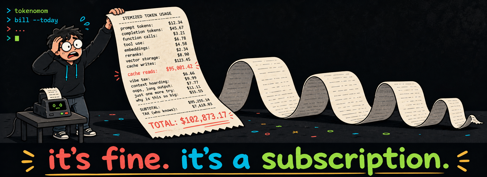

# tokenomnom

<p align="center">
  
</p>

Your coding agents nom tokens all day under a subscription, so the cost stays
invisible. `tokenomnom` reads their local logs and shows what the bill would
have been at API list prices: daily and monthly patterns, model breakdowns,
and a spend heatmap, all in the terminal.

Those dollar figures are API list-price equivalents. They are not your actual
Codex or Claude subscription bill.

## Install

macOS or Linux - the installer verifies checksums, writes to `~/.local/bin`,
and never uses sudo:

```sh
curl -fsSL https://raw.githubusercontent.com/janiorvalle/tokenomnom/main/install.sh | sh
```

Windows - download the zip from
[Releases](https://github.com/janiorvalle/tokenomnom/releases) and put both
executables on your `PATH`.

Go users:

```sh
go install github.com/janiorvalle/tokenomnom/cmd/tokenomnom@latest
go install github.com/janiorvalle/tokenomnom/cmd/nomnom@latest
```

Release archives ship both `tokenomnom` and its shorter `nomnom` alias. Check
either one with `tokenomnom --version` or `nomnom --version`.

## Why

<p align="center">
  
</p>

<p align="center">
  
</p>

## Use It

Run the dashboard:

```sh
tokenomnom
```

Get the overall picture:

```sh
$ tokenomnom summary
Active days: 116
Total: $134,655.61
```

See the last 30 active days or compare models:

```sh
tokenomnom daily --last 30
tokenomnom models
```

The calendar makes the expensive streaks obvious:

```text
$ tokenomnom heatmap --year 2026
    Jan  Feb Mar Apr May  Jun Jul Aug  Sep Oct  Nov Dec
     ·····▒▓▓▓▒░·····▒▒·▒▓░··████························
Mon  ······▒▓▓▒······░·▒▒█░▒▓██▓█························
Less ·░▒▓█ More
116 active days · total cost $134,655.61 · busiest 2026-07-13 · $28,474.65
```

Export one row per date, provider, and model:

```sh
tokenomnom export --out usage.csv
```

Every report accepts provider, model, and date filters. `--no-sync` uses the
stored data immediately when you are making several queries in a row.

## Agents

`--format json` is the stable machine interface. It returns one
`tokenomnom.report/v1` envelope; the complete contract is in
[docs/agent-api.md](docs/agent-api.md).

tokenomnom also ships an opt-in skill that teaches Codex and Claude Code which
commands answer common token and spend questions:

```sh
tokenomnom install-skill
tokenomnom install-skill --remove
```

The installer only writes under existing agent roots. It refuses to overwrite
a foreign `SKILL.md` unless you pass `--force`.

## Configuration

Codex and Claude Code data roots are detected automatically. Override them
with `--codex-dir` and `--claude-dir`, or with
`TOKENOMNOM_CODEX_DIR` and `TOKENOMNOM_CLAUDE_DIR`. Native `CODEX_HOME`
and `CLAUDE_CONFIG_DIR` are honored before the defaults `~/.codex` and
`~/.claude`.

Reports bucket dates in the system timezone. `--tz America/New_York` selects
an IANA timezone. Changing the stored timezone triggers a safe rebuild from
the source logs.

The SQLite store lives at `~/.local/state/tokenomnom/usage.db` on macOS and
Linux, or `%LOCALAPPDATA%\tokenomnom\usage.db` on Windows. Use
`TOKENOMNOM_STATE_DIR` to replace that directory. `XDG_STATE_HOME` is also
honored on Unix.

Pricing overrides live at `~/.config/tokenomnom/pricing.json`, or under
`TOKENOMNOM_CONFIG_DIR`. `XDG_CONFIG_HOME` is honored on Unix. An override
replaces the complete entry list for each model it names:

```json
{
  "my-model": [
    {
      "base_input": 2.5,
      "cache_read": 0.25,
      "output": 10,
      "status": "estimated",
      "source": "https://example.com/pricing"
    }
  ]
}
```

Rates are USD per million tokens. Keep secrets out of this file; pricing
overrides are data and need no credentials.

Set `NO_COLOR` or pass `--no-color` for plain output. `--format json` is
always unstyled. `--provider`, `--model`, `--since`, and `--until` narrow
reports; `--last` controls Daily's active-day window, `--year` selects a
heatmap calendar year, and `--no-chart` hides Daily or Monthly charts.

The standalone installer supports
`TOKENOMNOM_INSTALL_REPO`, `TOKENOMNOM_INSTALL_DIR`,
`TOKENOMNOM_INSTALL_BASE_URL`, `TOKENOMNOM_INSTALL_VERSION`, and
`TOKENOMNOM_INSTALL_ARCHIVE` for mirrors and local verification.

## How It Counts

tokenomnom reads local JSONL session logs. Nothing leaves the machine. Codex
cumulative counters are converted to deltas, rewrites and moved archives are
reconciled, and Claude's progressive message snapshots are deduplicated across
files before daily totals are stored. Ambiguous cache writes and unknown models
stay explicit instead of being guessed.

The local store preserves already-ingested history when an agent deletes or
archives a source file. See [DESIGN.md](DESIGN.md) for the detailed attribution,
pricing, and retention rules.

## Development

[CONTRIBUTING.md](CONTRIBUTING.md) has setup, test policy, and the provider
adapter guide. [SECURITY.md](SECURITY.md) has the disclosure process and local
trust model.

## License

MIT. See [LICENSE](LICENSE).
