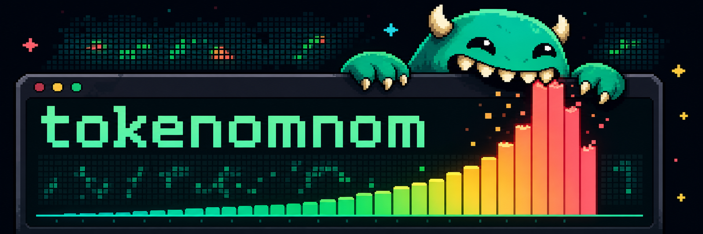
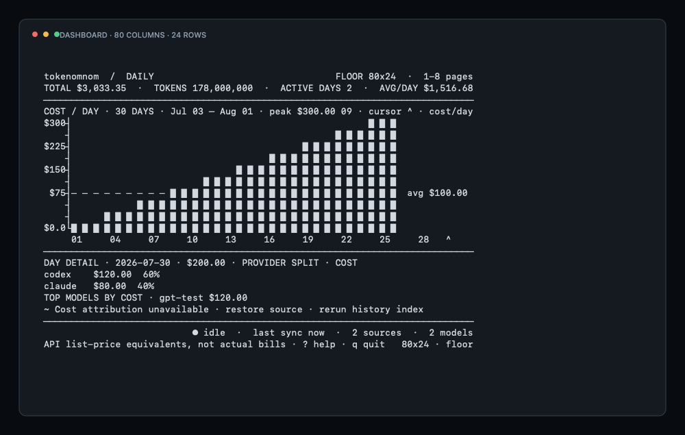
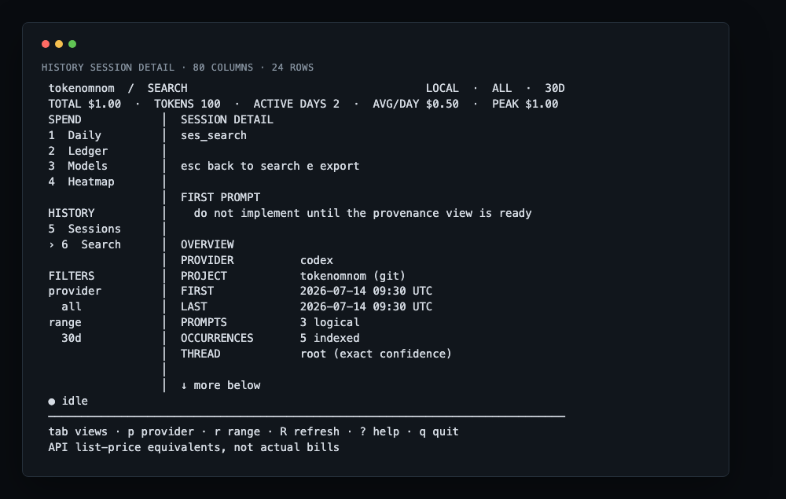

# tokenomnom

<p align="center">
  
</p>

Your coding agents nom tokens all day under a subscription, so the cost stays
invisible. `tokenomnom` reads their local logs and shows what the bill would
have been at API list prices: daily and monthly patterns, model breakdowns,
and a spend heatmap, all in the terminal.

Those same logs are also the full record of how you and your agents actually
work — and they don't survive on their own. Claude Code deletes transcripts
after about 30 days, and a busy Codex directory grows by tens of GB until you
wipe it. Either way the history is gone. tokenomnom's vault compresses every
session roughly 9x into a local, verified, byte-exact archive, so you can
reclaim the disk without losing anything.

On top of that archive sits a local history engine: index your sessions once,
then search years of your own prompts by exact phrase, list and filter
sessions, and pull representative samples — all offline, all bounded. It's how
you (or your agents) answer "what did I work on in March" without grepping raw
transcript directories. The bundled agent skill teaches Codex and Claude Code
to do exactly that.

Dollar figures are API list-price equivalents unless you set a user rate;
user rates are estimates, not your actual subscription bill.

## Install

macOS or Linux - the installer verifies checksums, writes to `~/.local/bin`,
and never uses sudo:

```sh
curl -fsSL https://raw.githubusercontent.com/janiorvalle/tokenomnom/main/install.sh | sh
```

Windows - download the zip from
[Releases](https://github.com/janiorvalle/tokenomnom/releases) and put both
executables on your `PATH`.

Go users:

```sh
go install github.com/janiorvalle/tokenomnom/cmd/tokenomnom@latest
go install github.com/janiorvalle/tokenomnom/cmd/nomnom@latest
```

Release archives ship both `tokenomnom` and its shorter `nomnom` alias. Check
either one with `tokenomnom --version` or `nomnom --version`.

## Use It

Run the dashboard:

```sh
tokenomnom
```

The dashboard stays readable in a 192x66 terminal, with the help overlay and
history detail available without leaving the keyboard:

<p align="center">
  
</p>

<p align="center">
  
</p>

Get the overall picture:

```sh
$ tokenomnom summary
Active days: 116
Total: $134,655.61
```

See the last 30 active days or compare models:

```sh
tokenomnom daily --last 30
tokenomnom models
```

The calendar makes the expensive streaks obvious:

```text
$ tokenomnom heatmap --year 2026
    Jan  Feb Mar Apr May  Jun Jul Aug  Sep Oct  Nov Dec
     ·····▒▓▓▓▒░·····▒▒·▒▓░··████························
Mon  ······▒▓▓▒······░·▒▒█░▒▓██▓█························
Less ·░▒▓█ More
116 active days · total cost $134,655.61 · busiest 2026-07-13 · $28,474.65
```

Export one row per date, provider, and model:

```sh
tokenomnom export --out usage.csv
```

Every report accepts provider, model, and date filters. `--no-sync` uses the
stored data immediately when you are making several queries in a row.

## History

Your transcripts are a searchable record of how you work. Build the index
once, explicitly, then query it:

```sh
tokenomnom history index
tokenomnom history search "do not implement" --since 2026-07-01
tokenomnom history search "delegated task" --thread-kind subagent
tokenomnom history list --root-only
tokenomnom history show prm_123
tokenomnom history export ses_123 --out ./session-export/
tokenomnom history stats --project-source git --group-by project --top 20
tokenomnom history sample --group-by month,project --count 25
tokenomnom history status
tokenomnom history purge
```

### Indexing

Indexing covers Codex live and archived files, Claude Code project files, and
every verified vault version. It resumes growing transcripts and reconciles
rewrites and moves, so live and vaulted copies of the same session show up as
one logical session.

Incremental runs trust matching source metadata instead of rereading unchanged
content, so a run over an unchanged corpus takes seconds. Two explicit deep
checks exist when you want them:

- `history index --verify` recomputes exact indexed-prefix continuity.
- `vault verify --deep` rechecks every archived transcript.

When a source file is permanently gone, acknowledge it instead of living with
a warning: `history index --settle-missing` for indexed sources,
`tokenomnom sync --settle-missing` for synced usage. Settled files keep their
usage and stay counted in `doctor`; the acknowledgement clears itself if the
file comes back. JSON output groups routine record exclusions into
`data.exclusion_counts` — see [docs/agent-api.md](docs/agent-api.md) for the
shapes.

### Search

Search is a literal adjacent-token phrase by default; `--fts-query` opts into
raw FTS5 syntax. Results are bounded snippets unless you ask for
`--include-text` or `history show`, and raw retrieval revalidates the exact
indexed bytes before returning them.

### Export

Export a complete session as one artifact when you need to hand it to another
agent or keep a readable copy:

```sh
tokenomnom history export ses_123 --out session.md
tokenomnom history export ses_123 --as normalized --out session.jsonl
tokenomnom history export ses_123 --as raw --out ./raw-session/
```

The default Markdown export resolves a prompt ID to its session and includes
related subagent sessions (`--no-subagents` narrows it). User and assistant
text stays complete; tool output and thinking are collapsed unless you ask for
them. Rendering reads and hash-validates the original bytes, falls back to a
valid vault version, and marks anything unavailable instead of silently
dropping it. `raw` writes one byte-exact JSONL file per transcript, plus a
`manifest.json` when the target is a directory; `normalized` writes
provider-neutral JSONL.

Without `--out`, Markdown and normalized exports write the artifact to stdout
and the report to stderr; raw exports always require `--out`. Existing files
are refused unless you pass `--force`. Markdown exports mark renderer
structure with a per-export nonce so programmatic consumers can tell renderer
structure apart from transcript content — the `structure_nonce` contract is in
[docs/agent-api.md](docs/agent-api.md).

One thing to take seriously: export is an explicit plaintext release from
tokenomnom's local state model. It can contain prompts, responses, paths, and,
when requested, tool output or thinking. Review the destination and its access
controls. Scheduled maintenance never runs exports.

### What the labels mean

A few honesty rules are built in:

- `project` is the git-proven repository name when available, otherwise the
  final segment of a known non-temporary cwd, otherwise `unknown` — and every
  value says which (`project_source: git|cwd|unknown`). Temp-directory cwds
  stay `unknown`.
- Root versus subagent classification comes from provider evidence or
  versioned deterministic rules; missing evidence stays `unknown` instead of
  being guessed. (For Codex 0.93.0+, the legacy `session_meta.source` values
  `cli`, `vscode`, `exec`, and `mcp` count as root evidence, since those
  producers mark delegated sessions with a distinct subagent shape.)
- Repository and branch filters are complete for Codex but partial for Claude
  Code, and repository fields are never inferred from cwd.
- Grouped stats and samples fold rare project labels into a visible `other`
  group rather than implying precision that isn't there.
- User-role records are classified (`human`, `delegation`, `agent_message`,
  `command`, `control`, `unknown`); human prompts are the default corpus, and
  `--prompt-kind` selects others. Full taxonomy and filter semantics:
  [docs/agent-api.md](docs/agent-api.md).

`history sample` pulls a deterministic, representative sample — same seed,
same corpus, same sample — with stratification via `--group-by` and guards
like `--one-per-session` so one long conversation can't dominate.

`history status` and `doctor` run a metadata-only freshness probe: current
file sizes and mtimes against stored checkpoints, with drift split into
active (running-session churn) and settled (old enough to act on). The probe
never reads transcript content.

### Privacy

Indexing never runs implicitly from usage reports or plain syncs, and user
prompts are the only corpus by default. `history.index_assistant = true` is
explicit consent to store assistant text too — expect it to multiply plaintext
storage. `history.db` can be more sensitive than `usage.db`, so it's excluded
from automatic backups; protect the state directory like the transcripts
themselves. `history purge` removes all indexed plaintext and touches nothing
else.

## Agents

`--format json` is the stable machine interface. It returns one
`tokenomnom.report/v1` envelope; the complete contract is in
[docs/agent-api.md](docs/agent-api.md).

tokenomnom also ships an opt-in skill that teaches Codex and Claude Code which
commands answer token and spend questions and how to search indexed history:

```sh
tokenomnom install-skill
tokenomnom install-skill --remove
```

The dashboard offers the skill once on first run. The installer only writes
under existing agent roots and refuses to overwrite a foreign `SKILL.md`
unless you pass `--force`.

Upgrade an installer-managed macOS or Linux binary in place:

```sh
tokenomnom upgrade --check
tokenomnom upgrade
```

The upgrade verifies the published checksum before atomically replacing the
running binary. When the tokenomnom agent skill is already installed, the new
binary refreshes it too; an absent skill stays absent.

## Keep It Fresh

Install a per-user maintenance schedule, inspect it, or remove it:

```sh
tokenomnom schedule install
tokenomnom schedule status
tokenomnom schedule uninstall
```

Each tick runs one quiet `sync --scheduled`: usage sync, due backup, due
auto-vault, then due history indexing. After a successful usage sync, failures
in backup, vault, or history indexing warn without discarding the earlier
steps' work. tokenomnom uses launchd on macOS, a systemd user timer on Linux,
and Task Scheduler on Windows — there is no daemon or resident process.

The installed unit embeds the current binary path and `schedule.interval`, so
re-run `schedule install` after moving or upgrading the binary or changing the
interval. Everything else is read fresh on every tick.

## Configuration

User config lives at `~/.config/tokenomnom/config.toml` on macOS and Linux,
or `%APPDATA%\tokenomnom\config.toml` on Windows. `XDG_CONFIG_HOME` and
`TOKENOMNOM_CONFIG_DIR` are honored. Precedence is command-line flag >
environment variable > config file > built-in default. `tokenomnom config
path` prints the path; `tokenomnom config show` prints the effective values
and where each one came from.

Every supported key and its default:

```toml
[discovery]
codex_dir = ""
claude_dir = ""

[sync]
timezone = ""

[reports]
color = "auto"
charts = true
daily_last = 30
default_provider = ""

[backup]
enabled = true
interval = "24h"
dir = ""
keep = 14

[vault]
dir = ""
min_age = "168h"
providers = ["codex", "claude"]
auto = true
auto_interval = "24h"

[history]
auto_index = true
index_assistant = false
auto_interval = "1h"
providers = ["codex", "claude"]

[schedule]
interval = "24h"
```

Notes on the keys that need them:

- **Discovery**: empty directories use automatic detection.
  `TOKENOMNOM_CODEX_DIR`, `TOKENOMNOM_CLAUDE_DIR`, `CODEX_HOME`, and
  `CLAUDE_CONFIG_DIR` still work.
- **Timezone**: empty uses the system zone; otherwise an IANA name like
  `America/New_York`. Changing it triggers a safe rebuild from the source
  logs.
- **Reports**: `color` accepts `auto`, `always`, or `never` (`NO_COLOR` and
  `--no-color` also work; `--format json` is always unstyled).
  `charts = false` matches `--no-chart`; `daily_last` supplies Daily's default
  `--last`; `default_provider` may be empty, `codex`, or `claude`.
- **Backups**: after each successful sync, a due online SQLite backup lands in
  `~/.local/share/tokenomnom/backups` (or the Windows user data directory;
  `XDG_DATA_HOME`/`TOKENOMNOM_DATA_DIR` replace the base). `keep = 0` keeps
  every backup. Backup failures warn but never block a report.
- **Vault**: empty `dir` uses `<data-dir>/vault`; `min_age` is the settle time
  before archiving; when `auto` is true, successful syncs archive settled
  files at most once per `auto_interval`. Source transcripts are never
  deleted.
- **History auto-index**: defaults to `true` for new installations. Existing
  config files that omit the key stay opt-in on upgrade — add
  `history.auto_index = true` explicitly — so upgrading cannot start building
  a plaintext index without consent. Only `sync --scheduled` runs a due index
  pass, at most once per `auto_interval`. `index_assistant` has no flag or
  env override; enable it in config, then run `history index`.
- **Schedule**: `interval` must be a whole-second Go duration; changing it
  requires another `schedule install`, and `schedule status` flags drift.
  Windows Task Scheduler supports 1 minute through 31 days.

The SQLite store lives at `~/.local/state/tokenomnom/usage.db`
(`%LOCALAPPDATA%\tokenomnom\usage.db` on Windows); `TOKENOMNOM_STATE_DIR` and
`XDG_STATE_HOME` replace the directory. The history index uses `history.db`
beside it and is deliberately excluded from automatic backups.

### Pricing

To price a model that has no published rate, set a user rate:

```sh
tokenomnom pricing set-rate MODEL --input 1.25 --output 8
tokenomnom pricing set-rate MODEL --clear
```

User rates live in `user-rates.json` in the config directory, take precedence
over published rates, and are labeled `user rate` in reports and the
dashboard (JSON uses `provenance: "user"`; CSV export carries no provenance
column).

To replace a model's complete published entry instead, `pricing.json` in the
same directory takes a full entry list per model. Rates are USD per million
tokens; this file is data and needs no credentials:

```json
{
  "my-model": [
    {
      "base_input": 2.5,
      "cache_read": 0.25,
      "output": 10,
      "status": "estimated",
      "source": "https://example.com/pricing"
    }
  ]
}
```

Attribution and dedupe rules, day-bucketing semantics, the store schema, the
JSON contract, pricing math, and disclaimer text are deliberately not
configurable. Those are correctness contracts, not display preferences.

The standalone installer supports `TOKENOMNOM_INSTALL_REPO`,
`TOKENOMNOM_INSTALL_DIR`, `TOKENOMNOM_INSTALL_BASE_URL`,
`TOKENOMNOM_INSTALL_VERSION`, and `TOKENOMNOM_INSTALL_ARCHIVE` for mirrors and
local verification.

## Vault

Coding agents throw their own history away. The vault is where it survives:
every archived source is preserved byte-for-byte in monthly, provider-specific
`.tar.zst` bundles, with a versioned manifest in the usage database.

```sh
tokenomnom vault archive
tokenomnom vault list --provider codex --since 2026-06-01 --limit 100 --latest --format json
tokenomnom vault cat ~/.codex/sessions/2026/06/13/rollout-….jsonl | jq .
tokenomnom vault verify --deep
tokenomnom vault status
```

`archive` handles settled files (`--all` ignores the settle age and rechecks
hashes), `list` pages the manifest (follow `data.page.next_cursor` when
`has_more` is true), `cat` restores original bytes to stdout, `verify` checks
bundles, and `status` reports compression and reclaimable originals. JSON
`vault cat` returns readable `content` for UTF-8 transcripts alongside
`content_base64`. `doctor` reports usage-sync, archive, deep-verification, and
status-scan times as separate facts. A missing synced source keeps its usage
totals; raw access then depends on whether it was vaulted.

tokenomnom never modifies or deletes source transcripts. Reclaiming a verified
original listed by `vault status` is always a manual decision.

## How It Counts

tokenomnom reads local JSONL session logs. Nothing leaves the machine. Codex
cumulative counters are converted to deltas, rewrites and moved archives are
reconciled, and Claude's progressive message snapshots are deduplicated across
files before daily totals are stored. Ambiguous cache writes and unknown
models stay explicit instead of being guessed.

The local store preserves already-ingested history when an agent deletes or
archives a source file. See [DESIGN.md](DESIGN.md) for the detailed
attribution, pricing, and retention rules.

## Development

[CONTRIBUTING.md](CONTRIBUTING.md) has setup, test policy, and the provider
adapter guide. [SECURITY.md](SECURITY.md) has the disclosure process and local
trust model.

## License

MIT. See [LICENSE](LICENSE).
